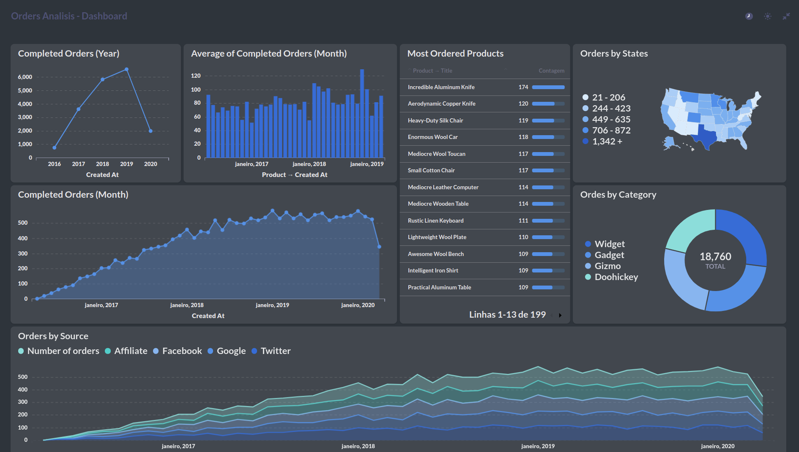

# METABASE - DASHBOARDS

Desenvolvi uma série de dashboards utilizando a plataforma Metabase, com o objetivo de aprofundar meu conhecimento em análise de dados e práticas de SQL. Através deste projeto, explorei a criação de visualizações intuitivas e interativas, transformando dados brutos em insights acionáveis. Ao utilizar o Metabase, pude aprimorar minha compreensão das capacidades de visualização de dados e, ao mesmo tempo, fortaleci minhas habilidades em consultas SQL complexas para manipular e extrair informações relevantes. Essa experiência não apenas me permitiu expandir meu domínio técnico, mas também destacou minha capacidade de transformar dados em valor tangível por meio de soluções analíticas eficazes

## Demonstração
### ORDERS:
+ Vendas por Mês e Ano
+ Produtos mais vendidos
+ Vendas por Local e Categoria
+ Dentre outros...

    
    

### Users:
+ Total de Usuários
+ Crescimento Anual
+ Feedbacks e Reviews
+ Dentre outros...

    
    

## Contato
Se você tiver alguma dúvida ou precisar entrar em contato, pode me encontrar em:

Email: vinicius@bragamatta.com ou vinibm85@gmail.com

GitHub: https://github.com/VinicinBraga

Linkedin: https://www.linkedin.com/in/vinícius-braga
